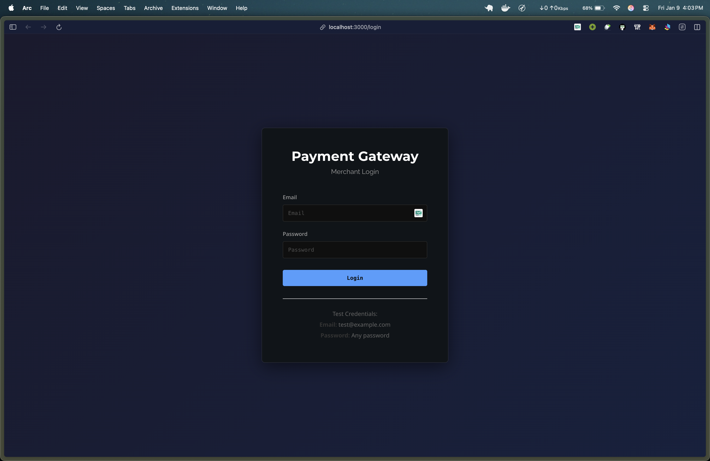
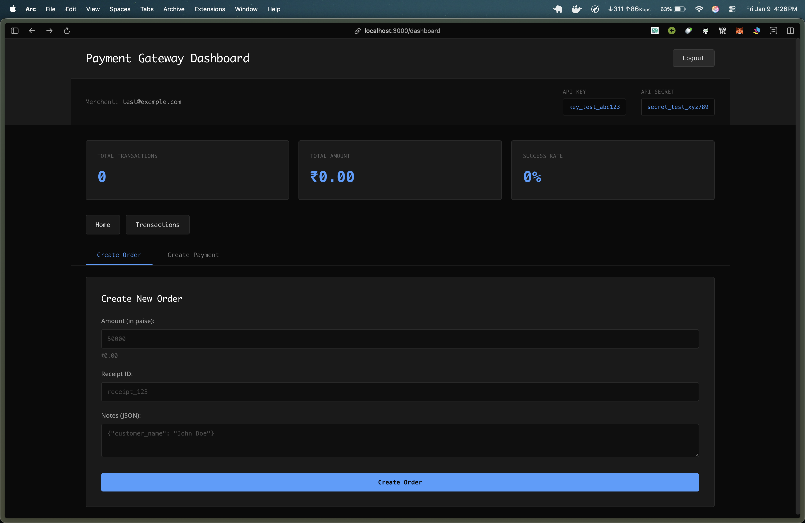
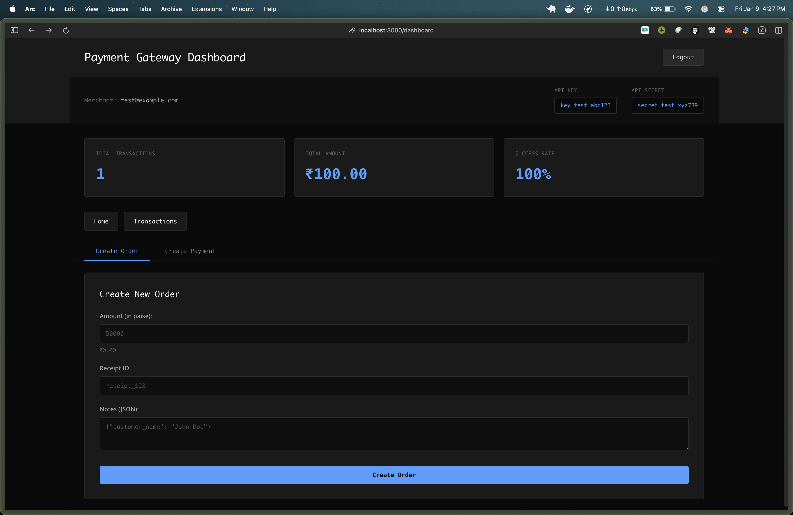
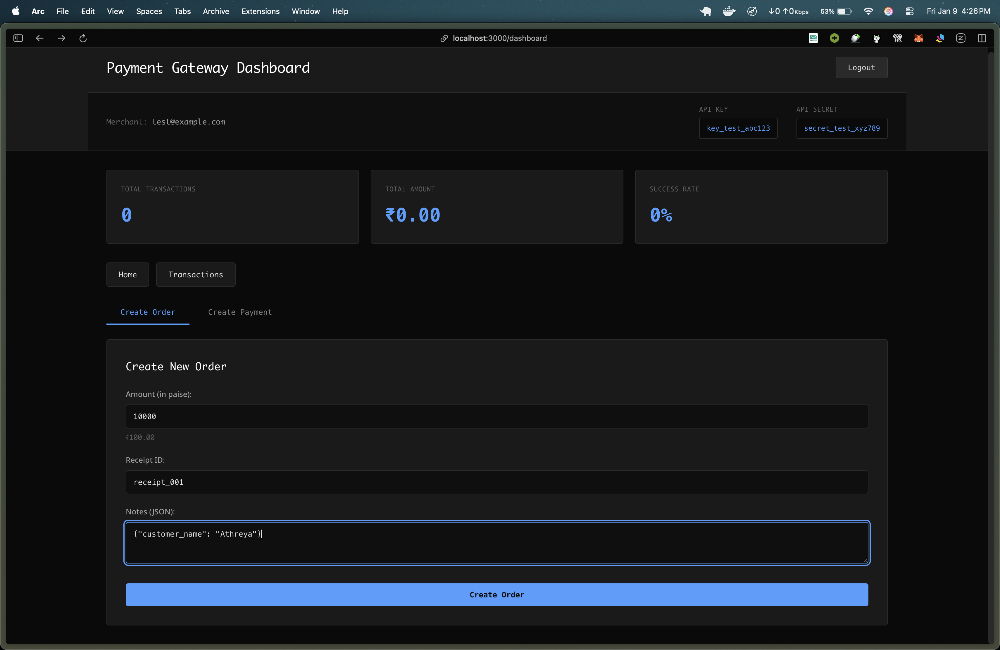
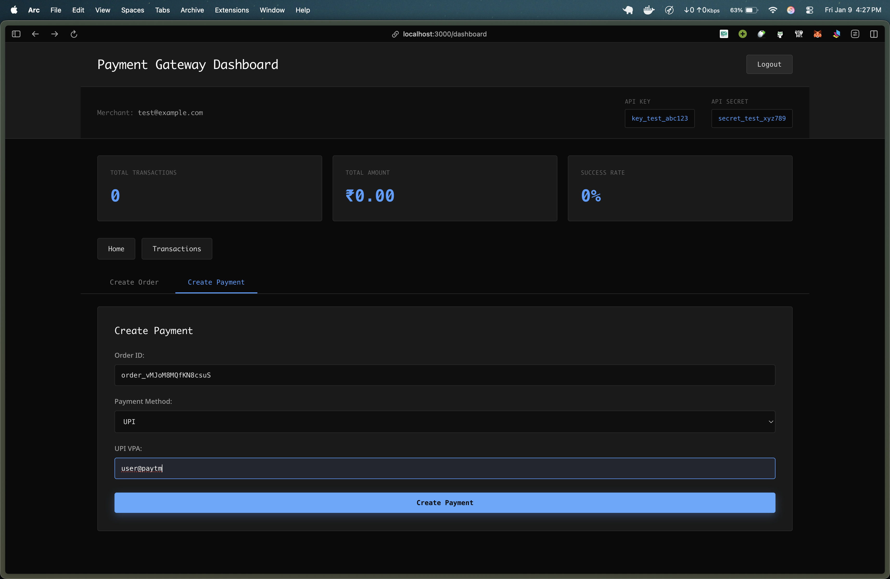
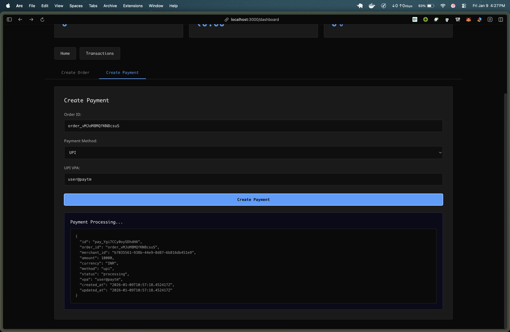

# 💳 Payment Gateway


A full-stack payment gateway with UPI and card payments, merchant auth, validation, async processing, and a dashboard + checkout experience.

## What’s Inside
- Backend (Spring Boot, Postgres, Redis) with order/payment APIs, validation, async processing, and health checks.
- Frontend dashboard (React + Vite) for login, stats, and transactions.
- Checkout page for public payment capture (UPI and card).
- Docker Compose for one-command startup.

## Architecture
- API: Java 21, Spring Boot 3, Postgres, Redis; amounts stored in paise (integers), success rates configurable.
- Dashboard: React SPA served via Nginx in container.
- Checkout: Standalone React page served via Nginx.
- Containers: `postgres`, `redis`, `api`, `dashboard`, `checkout` wired by docker-compose.

## Prerequisites
- Docker + Docker Compose
- (Optional for local dev) Java 21, Node.js 20+

## Quick Start (Docker)
```bash
docker compose up -d --build
# Health
curl http://localhost:8000/health
```
Services:
- API: http://localhost:8000
- Dashboard: http://localhost:3000
- Checkout: http://localhost:3001

## Local Development
Backend:
```bash
cd backend
./mvnw spring-boot:run
```
Frontend dashboard:
```bash
cd frontend
npm install
npm run dev -- --host --port 5173
```
Checkout page:
```bash
cd checkout-page
npm install
npm run dev -- --host --port 5174
```
Provide Postgres/Redis locally via `.env` or environment vars (see below).

## Environment Variables
- `PORT` (default 8000)
- `DATABASE_URL` (e.g., jdbc:postgresql://localhost:5432/payment_gateway)
- `DATABASE_USERNAME`, `DATABASE_PASSWORD`
- `REDIS_HOST` (default localhost), `REDIS_PORT` (default 6379)
- `TEST_MODE` (true/false), `TEST_PAYMENT_SUCCESS`, `TEST_PROCESSING_DELAY` (ms)
- `HEALTH_REDIS_OPTIONAL` (default false), `HEALTH_WORKER_OPTIONAL` (default true)

## Health Check
- Endpoint: `GET /health`
- Status is healthy only when database connected, Redis connected, worker running (unless worker optional is disabled by env).

## Authentication
Authenticated endpoints require headers:
```
X-Api-Key: key_test_abc123
X-Api-Secret: secret_test_xyz789
```
Public endpoints (for checkout) are marked below.

## Seeded Test Merchant
- Merchant ID: 550e8400-e29b-41d4-a716-446655440000
- API Key: key_test_abc123
- API Secret: secret_test_xyz789
- Retrieve: `GET /api/v1/test/merchant` (public)

## API Endpoints Reference

| Method | Endpoint | Auth | Description |
|--------|----------|------|-------------|
| GET | `/health` | No | System health check (DB, Redis, Worker) |
| GET | `/api/v1/test/merchant` | No | Get test merchant credentials |
| POST | `/api/v1/orders` | Yes | Create order |
| GET | `/api/v1/orders/{order_id}` | Yes | Get order (merchant-only) |
| GET | `/api/v1/orders/{order_id}/public` | No | Get order (public for checkout) |
| POST | `/api/v1/payments` | Yes | Create payment (authenticated) |
| GET | `/api/v1/payments/{payment_id}` | Yes | Get payment (merchant-only) |
| POST | `/api/v1/payments/public` | No | Create payment (public for checkout) |
| GET | `/api/v1/payments/{payment_id}/public` | No | Get payment (public for checkout) |

## Amounts
- All amounts are in paise (integers) in the API/database.
- Frontend and docs display rupees for readability; convert as needed.

## Orders
Create order (auth):
```bash
curl -X POST http://localhost:8000/api/v1/orders \
  -H "Content-Type: application/json" \
  -H "X-Api-Key: key_test_abc123" \
  -H "X-Api-Secret: secret_test_xyz789" \
  -d '{"amount":50000,"currency":"INR","receipt":"receipt_123","notes":{"customer":"John Doe"}}'
```
Get order (auth): `GET /api/v1/orders/{order_id}`
Get order (public): `GET /api/v1/orders/{order_id}/public`

## Payments
Create payment (auth):
```bash
curl -X POST http://localhost:8000/api/v1/payments \
  -H "Content-Type: application/json" \
  -H "X-Api-Key: key_test_abc123" \
  -H "X-Api-Secret: secret_test_xyz789" \
  -d '{"order_id":"order_x","method":"upi","vpa":"user@okaxis"}'
```
Public create (for checkout): `POST /api/v1/payments/public` (same body, no auth).
Get payment (auth): `GET /api/v1/payments/{payment_id}`
Get payment (public): `GET /api/v1/payments/{payment_id}/public`

Payment methods:
- `method: "upi"` with `vpa`
- `method: "card"` with `card.number`, `expiry_month`, `expiry_year`, `cvv`, `holder_name`

Statuses:
- Created payments start as `processing`, then transition to `success` or `failed`.
- Production randomness: UPI ~90% success, Card ~95%, with 5–10s delay.
- Test mode: control via `TEST_PAYMENT_SUCCESS` and `TEST_PROCESSING_DELAY`.

Validation highlights:
- VPA regex validation; bad input returns `INVALID_VPA`.
- Card number Luhn check; bad input returns `INVALID_CARD`.
- Expiry validation and amount >= 100 paise enforced.

## Frontend Dashboard
- Login with test email (any password accepted for demo).
- Shows API key/secret, totals, success rate, and transactions table.
- Talks to API at `http://localhost:8000` (configurable via `VITE_API_BASE_URL`).

## Checkout Page
- Load with `?order_id=...` to fetch order publicly.
- Supports UPI and card capture via public payment endpoints.
- Polls payment status until success/failure and shows final state with retry option.

## Testing (manual quick checks)
```bash
# Health
curl http://localhost:8000/health
# Create order
curl -X POST http://localhost:8000/api/v1/orders ...
# Create payment (auth or public)
curl -X POST http://localhost:8000/api/v1/payments ...
# Poll payment
curl http://localhost:8000/api/v1/payments/{payment_id}
```

## Security
- API key/secret required for merchant-auth endpoints.
- CVV and full card numbers are not stored; only last4 and network are persisted.
- Use environment variables for secrets; do not commit `.env`.

## Deployment Notes
- Use `docker compose up -d --build` for reproducible stack.
- Health depends on Redis by default; set `HEALTH_REDIS_OPTIONAL=true` only if you intentionally run without Redis.

## 📚 Documentation

- [Architecture & Flows](ARCHITECTURE.md) — System design, components, and data flows.
- [Database Schema](DATABASE.md) — Table relationships, constraints, and indexes.
- [API Tests](api-tests.http) — Example curl commands (REST Client format).

## 📸 Screenshots

Dashboard

- Login page: 
- Home dashboard: 
- Transactions list: 
- Transaction statistics: 

API Flow (for demo video)

- Order creation (API): 
- Successful order creation: 
- Payment creation (API): 

Checkout Flow

- Processing state: 
- Success state: 

## 🎯 Quick Reference

| Feature | Status | Details |
|---------|--------|---------|
| Order Creation | ✅ | Authenticated, paise amounts, auto ID |
| Payment Creation | ✅ | UPI & Card, async 5-10s processing |
| Validation | ✅ | Luhn, VPA regex, expiry checks |
| Health Check | ✅ | DB, Redis, Worker status |
| Dashboard | ✅ | Login, stats, transactions |
| Checkout | ✅ | Public order fetch, payment capture |
| Docker | ✅ | Full stack orchestration |
| Redis | ✅ | Required for health, queuing |

## 🚀 Next Steps

1. **Verify Setup**: `docker compose up -d --build && curl http://localhost:8000/health`
2. **Create Order**: Use POST /api/v1/orders with test credentials
3. **Process Payment**: POST /api/v1/payments and poll for status
4. **Test Dashboard**: Navigate to http://localhost:3000
5. **Test Checkout**: http://localhost:3001?order_id=order_xxx
